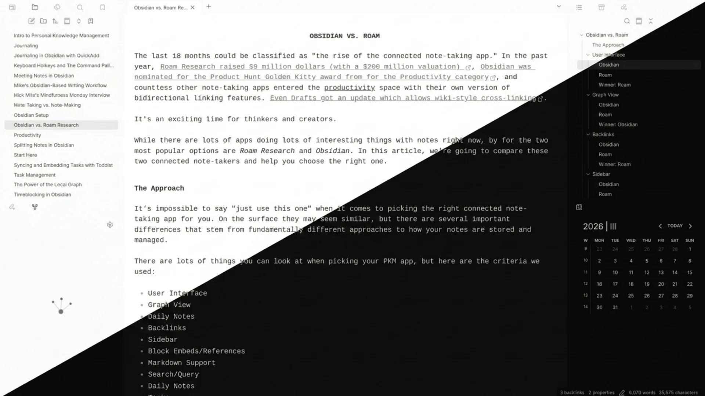
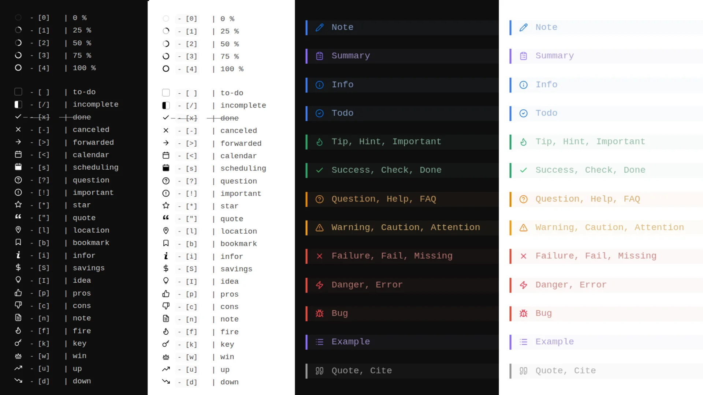

# Karadigm

A minimalist, nearly monochromatic Obsidian theme with clean typography and a unified checkbox set.

## Features

- Nearly monochromatic UI — backgrounds, text, and borders in shades of grey
- Subtle colored left border on callouts, no visual noise
- 24 unified task checkboxes + 5 circular progress indicators
- Color accent picker via [Style Settings](https://github.com/mgmeyers/obsidian-style-settings) plugin
- Three built-in color presets: Blue, Green, Red

## Style Settings

Install the [Style Settings](https://github.com/mgmeyers/obsidian-style-settings) plugin to access accent color options:

- **Color variant** — choose Blue, Green, or Red preset
- **Custom color** — pick any accent color (active when no preset is selected)

## Checkbox & callout reference

All checkboxes and callouts at a glance — dark and light mode:

## Author

[Luko Karavan](https://www.lukokaravan.cz/en/) · [Short stories in English](https://antihistor.substack.com) · [Ko-fi](https://ko-fi.com/karavan)
