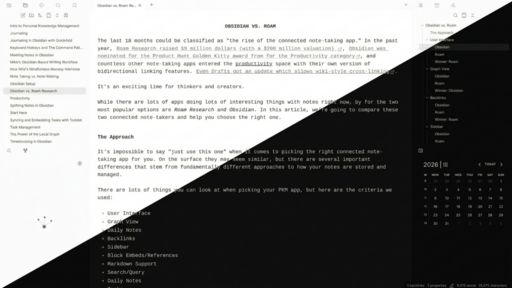

# Karadigm

A minimalist, nearly monochromatic Obsidian theme with clean typography and a unified checkbox set.

## Features

- Nearly monochromatic UI — backgrounds, text, and borders in shades of grey
- Subtle colored left border on callouts, no visual noise
- 24 unified task checkboxes + 5 circular progress indicators
- Color accent picker via [Style Settings](https://github.com/mgmeyers/obsidian-style-settings) plugin
- Three built-in color presets: Blue, Green, Red

## Style Settings

Install the [Style Settings](https://github.com/mgmeyers/obsidian-style-settings) plugin to access accent color options:

- **Color variant** — choose Blue, Green, or Red preset
- **Custom color** — pick any accent color (active when no preset is selected)

## Checkbox reference

| Icon | Code | Label |
|------|------|-------|
|  | `- [ ]` | to-do |
|  | `- [/]` | in progress |
|  | `- [x]` | done |
|  | `- [-]` | cancelled |
|  | `- [>]` | forwarded |
|  | `- [<]` | scheduled |
|  | `- [s]` | scheduled today |
|  | `- [?]` | question |
|  | `- [!]` | alert |
|  | `- [*]` | star |
|  | `- ["]` | quote |
|  | `- [l]` | location |
|  | `- [b]` | bookmark |
|  | `- [i]` | info |
|  | `- [S]` | finance |
|  | `- [I]` | idea |
|  | `- [p]` | pro |
|  | `- [c]` | con |
|  | `- [n]` | note |
|  | `- [f]` | fire |
|  | `- [k]` | key |
|  | `- [w]` | win |
|  | `- [u]` | uptrend |
|  | `- [d]` | downtrend |
|  | `- [0]` | 0% |
|  | `- [1]` | 25% |
|  | `- [2]` | 50% |
|  | `- [3]` | 75% |
|  | `- [4]` | 100% |

## Author

[Luko Karavan](https://www.lukokaravan.cz) · [Ko-fi](https://ko-fi.com/karavan)
